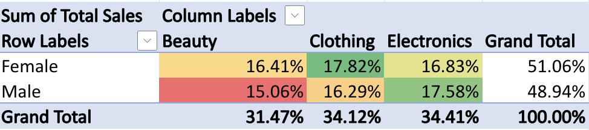
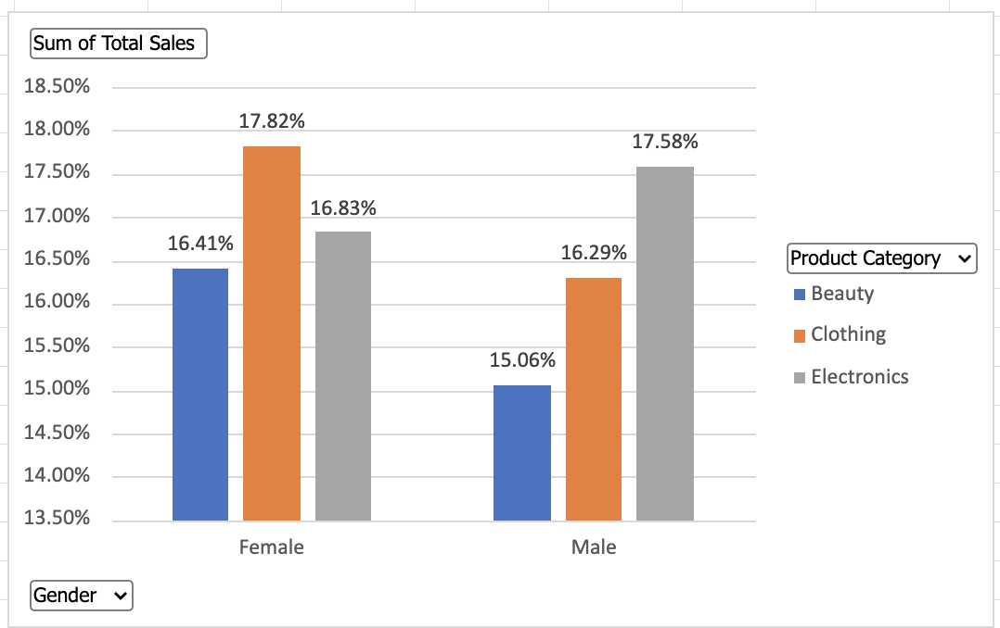

# 📊Retail Sales Analysis & Interactive Reporting

**Author:** Swida Saeed  
**Tool Used:** Microsoft Excel  
**Dataset:** Retail Sales Data  

---

# 📌 Project Overview

This project demonstrates the use of Microsoft Excel to analyse retail sales data and build an interactive reporting solution using pivot tables, conditional logic, and slicers.

The objective was to transform structured retail data into a dynamic dashboard that supports performance monitoring and category comparison.

---

# 🔎 Data Analysis Approach

## Data Structuring
- Organised raw data into structured Excel tables  
- Applied sorting and filtering  
- Ensured consistent formatting  

## Aggregation & Functions
- Calculated totals using `SUM()`  
- Calculated averages using `AVERAGE()`  
- Identified highest values using `MAX()`  

## Product Categorisation
Used the `SWITCH()` function to categorise products by sales volume:

- Sales > 600 → High  
- Sales 300–600 → Medium  
- Sales < 300 → Low  

---

# 📊 Pivot Table Analysis

The pivot table summarises total sales percentages by:

- Gender  
- Product Category (Beauty, Clothing, Electronics)  

Conditional formatting was applied to highlight higher and lower performance segments.

---

# 📈 Interactive Pivot Chart

A pivot chart visualises total sales percentage by:

- Gender  
- Product Category  

This enables quick comparison of category performance across customer segments.

---

# 🛠 Excel Skills Demonstrated

- Structured data tables  
- Pivot tables  
- Pivot charts  
- Conditional formatting  
- Slicers  
- SUM, AVERAGE, MAX functions  
- SWITCH logic  
- Interactive reporting design  

---

# 📁 Project Files

📊 **Retail Sales Dataset**  
[retail_sales_dataset.xlsx](retail_sales_dataset.xlsx)

📈 **Pivot & Slicer Dashboard**  
[Pivot_Slicer.xlsx](Pivot_Slicer_Completed.xlsx)

---

# 🎯 Business Value

This solution enables:

- Category performance comparison  
- Gender-based sales analysis  
- Identification of high-performing product groups  
- Interactive filtering for targeted insights  

The project demonstrates the ability to use Excel as a lightweight business intelligence tool for structured reporting.
